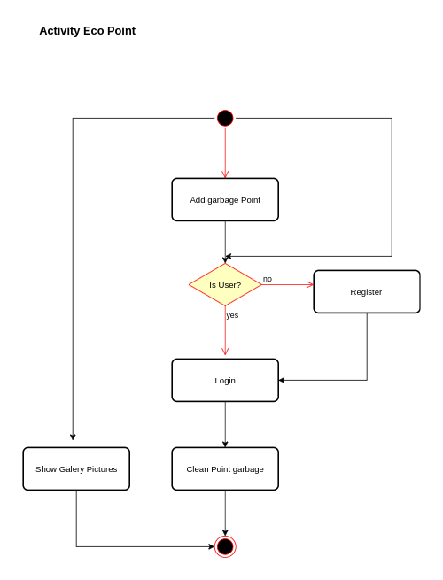
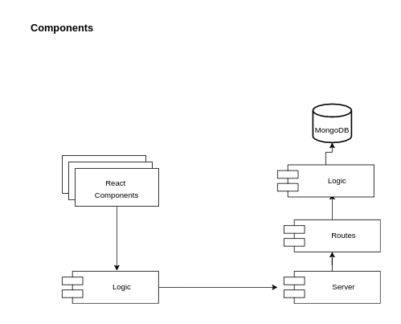
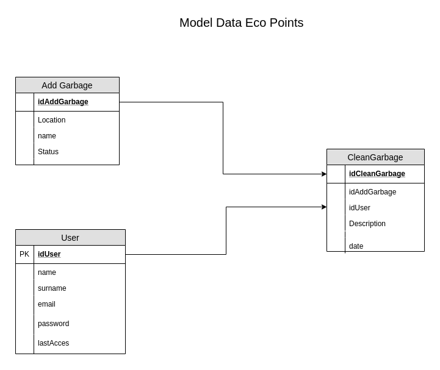

# Project ECO POINTS

## INTRODUCTION

Eco Point is an APP that will allow the user to mark points in areas where they can appreciate the presence of garbage dumped in areas such as rural roads, trails, beaches. For those users who do diving, they can mark that point in the centers. The idea is that those associations or communities that want to take action on those areas have references.

The user can enter the point using the menu option addgarbage. This option will only be valid if a name is entered and an image is attached.

## Functional Description
* Add garbage point: you need to access the websuit and select the menu item add point garbage. A new page will appear and you will be asked to enter your name and     include an image of the discharge. it will only be possible to add a point every 100 meters (Future implementattion)

* Clean garbage point: To indicate that the garbage point has been cleaned, it is necessary to click on the point and a popup will appear that will allow you to        upload an image. The popup will not be displayed unless it is logged in, and in order to log in you will need to register first.
* Register and Login user.
* Show galery images

### Uses Cases

### Activity Diagram

## Tecnical Dscription

### Blocks

### Components

### Data Model

### Code Coverage

### Built with
    Javascript (ES6)
#### Client

+ React Hooks
+ Html5
+ CSS

#### Server
+ Node.js
+ Express
+ MongoDB, Mongoose

## Results test ⚙️

_

## Version 📌
v.0

## Authors ✒️

* **Joan Luis Morales** - *Trabajo Inicial* - [git Joan](https://github.com/joan)

## Thanks to 🎁

* Skylab Coders
* Teach Team: Manu, Jose, Jorge 
* 
* thanks in general; Bootcampmates, remarkable: Martín, Aitor, Nacho,  Xavi Sevilla, Isidro, Adri H, Jose y Oscar Rodriguez  🤓
* 
## Difficulties
* Linux system problems of software and hardware to run some frameworks and libraries such as Sass and  Mocha

## Future Versions
* Include the image of the Location created in the popup view
* Do not allow to add more locations within a radius of 100m
* The action that allows the modification of the echo point by clicking on the popup image. The logic must verify the existence of the user,
 only logged-in users can modify the eco-points

